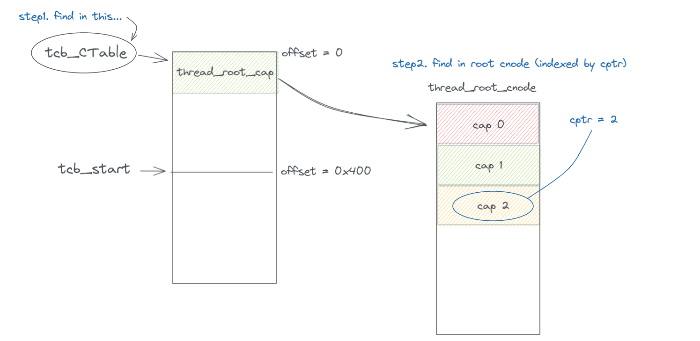

# syscall简要分析

以x86为例，分析系统调用从陷入到返回的全过程。

## 1. 寄存器的准备

static inline void x64_sys_send_recv(seL4_Word sys, seL4_Word dest, seL4_Word *out_dest, seL4_Word info,
                                     seL4_Word *out_info, seL4_Word *in_out_mr0, seL4_Word *in_out_mr1, seL4_Word *in_out_mr2, seL4_Word *in_outv_mr3,
                                     LIBSEL4_UNUSED seL4_Word reply)

设置各个寄存器如下：

```c
rdi = dest
rsi = info
rdx = sys
r8 = *in_out_mr1
r9 = *in_out_mr2
r10 = *in_out_mr0
r15 = *in_out_mr3
```

rdi是系统调用的第一个参数，保存一个cptr，标识当前线程cspace_root下需要操作的cap。
rsi是系统调用的第二个参数，保存message_info（一个64位变量），包含label, capsUnwrapped, extraCaps, length四个域。

label一般用来标识系统调用需要执行的操作，类似opcode
capsUnwrapped标识需要拆封的capablity数量
extraCaps标识随ipc附带的cap数量
length标识message寄存器的数量

然后调用syscall指令，执行跳转到 `handle_fastsyscall`进行陷入处理。

## 2. handle_fastsyscall，假设SMP未开启

(1) 切换到内核页表：LOAD_KERNEL_AS(rsp)

实质上是将cr3寄存器（页表基址）赋值为0xa10000(x64KSKernelPML4)，切页表的同时会自动刷新TLB.

(2) 保存用户上下文LOAD_USER_CONTEXT

首先将rsp指向当前线程的用户上下文寄存器区域，然后保存寄存器到目标位置：

```c
    pushq   $-1             # set Error -1 to mean entry via syscall
    push    %rcx            # save NextIP
    push    %r11            # save RFLAGS
    push    %r15            # save R15 (message register)
    push    %r9             # save R9 (message register)
    push    %r8             # save R8 (message register)
    push    %r10            # save R10 (message register)
    push    %rdx            # save RDX (syscall number)
    push    %r14
    push    %r13
    push    %r12
    push    %rbp
    push    %rbx
    push    %rax
    push    %rsi            # save RSI (msgInfo register)
    push    %rdi            # save RDI (capRegister)
```

(3) 切换到内核栈：设置rsp为kernel_stack_alloc + (1 << CONFIG_KERNEL_STACK_BITS)。seL4中为每个hart分配一个内核栈，而不是为每个thread分配一个内核栈。

(4) 跳转到c_handle_syscall

## 3. c_handle_syscall

(1) benchmark_debug_syscall_start

benchmark_debug_syscall_start(word_t cptr, word_t msgInfo, word_t syscall)
这个部分暂时没什么用。

(2) 设置faultIP

faultIP意为若系统调用产生错误，将要在返回用户态时跳转到的地址。这里使faultIP指向本次陷入的syscall指令。

(3) 如果是系统调用(sys == -1)的话，跳转到fastpath_call。

## 4. 尝试执行快速系统调用fastpath_call

首先要判定是否可执行fastpath，若不能则进入slowpath的处理过程。

(1) fastpath_mi_check：检查msginfo是否包含extraCaps，以及length是否大于4。若有任意一项满足，只能执行slowpath。

(2) 在当前线程的cspace_root中查找cptr对应的cap。如果该cap不是endpoint类型，则不能执行fastpath。

(3) 该cap指向的endpoint必须处于EPState_Recv阶段（即有线程在该endpoint上recv，且被阻塞）。否则不能执行fastpath。

(4) ipc的目标线程的VTable必须有效，否则不能执行fastpath。

fastpath的部分会在ipc讨论。

## 5. slowpath

**若sys在-8到-1之间，则handleSyscall进行对应系统调用的处理（handleInvocation）**

以sys == -1为例，执行handleInvocation(isCall=true, isBlocking=true)：

a. 在当前线程的thread_root_cnode找到cptr对应的那个cap。


b. 调用lookupIPCBuffer，找到当前进程的ipc buffer地址（内核地址）。具体的操作是在当前线程的TCB_CTable中找到bufferCap，然后从中读出basePtr，basePtr就是我们需要的地址。

c. 调用lookupExtraCaps，在ipcBuffer中找到当前syscall传入的所有extraCaps，并将它们保存在全局变量current_extra_caps中。

d. 执行decodeInvocation，根据syscall第一个参数cptr指向的cnode类型来决定进入何种Invocation的处理。

e. 以CNodeCopy为例，该syscall进入的是decodeCNodeInvocation的处理流程：

- 从mr0中读出dest_index，mr1中读出dest_depth，然后以cptr(_service)为根查找dest_index的slot，查找结果保存在destSlot中。
- 从mr2和mr3中分别读出srcIndex和srcDepth，从extraCaps中读出src_root，同样找出对应的srcSlot，检查srcSlot保证其cap不为null。
- 通过deriveCap，从srcSlot复制一份cap从而生成newCap。
- 设置当前线程的状态为ThreadState_Restart。
- 调用invokeCNodeInsert，在destSlot中插入newCap。

***5.2 若sys不在此区间，则handleUnkownSyscall。**

handle_syscall之后会进行一次schedule()，进行线程的调度。一般情况下，当前调度器的行为ksSchedulerAction是默认的SchedulerAction_ResumeCurrentThread，则实际不执行线程的切换；否则需要进行线程切换。

## 6. 恢复用户上下文restore_user_context
